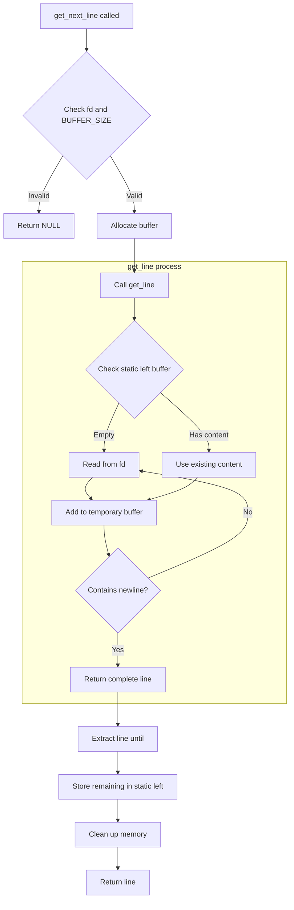

# Get Next Line

`get_next_line` is a C function that reads text from a file descriptor line by line, without requiring the entire file to be loaded into memory. This project is part of the 42 School curriculum and focuses on static variables, memory management and file handling efficiently.

**Table of contents**
- [Features](#-feautres)
- [How it works](#How-it-works)
- [What I learned](#What-I-learned)

## 📋 Features:

- Line-by-line Reading: Returns one line at a time from a file descriptor
- Multiple File Support: Can read from up to 1024 different files simultaneously (bonus part)
- Memory Efficient: Dynamic memory allocation with proper cleanup
- Configurable Buffer: Buffer size can be defined at compilation time
- Error Handling: Robust error management for various edge cases
- No Memory Leaks: Complete memory management with proper cleanup

## 🔍 How it works

Buffer Management:
- A static buffer maintains the leftover characters between function calls.
- For the bonus part, an array of static buffers handles multiple file descriptors.

Reading Process:

- The function reads from the file descriptor using a defined buffer size.
- Content is accumulated until a newline character is found or eof.
- The line is extracted and returned, with remaining content saved for the next call.

Memory Handling:

- Dynamic memory allocation for buffers and string operations.
- Careful memory cleanup in case of errors.
- Proper freeing of resources when no longer needed.

## 🚀 What I Learned

1. Static Variables:
	- Understanding persistence between function calls
	- Managing state in C functions
	- Handling multiple instances with static arrays

2. Memory Management:
	- Dynamic allocation with malloc
	- Proper memory cleanup to prevent leaks
	- Buffer management and string manipulation

3. File Operations:
	- Working with file descriptors
	- Understanding read operations and buffer sizes
	- Handling I/O errors and edge cases

4. String Manipulation:
	- Implementing custom string functions
	- Efficient string joining and substring operations
	- Buffer overflow prevention

4. Code Organization:
	- Separating utility functions
	- Creating maintainable and reusable code
	- Implementing bonus features without duplicating code

## Project structure

Main Functions (get_next_line.c):

- get_next_line: Main function
- get_line: Handles buffer reading and line assembly
- index_endline: Newline character detection
- cleanup_memory: Manages memory cleanup

Utility Functions (get_next_line_utils.c):

- ft_strlen: String length calculation
- ft_strdup: String duplication
- ft_substr: Substring extraction
- ft_strjoin: String concatenation

## References

- [Video concept](https://youtu.be/-Mt2FdJjVno?si=E80d-zj48wAzHebH)
- [Static variables](https://en.wikipedia.org/wiki/Static_variable)
- [About maximum files that can be openend at the same time](https://stackoverflow.com/questions/17931583/maximum-number-of-files-that-can-be-opened-by-c-fopen-in-linux)

**Interesting things I learned:**
- [Use of valgrind for memory leaks](https://stackoverflow.com/questions/5134891/how-do-i-use-valgrind-to-find-memory-leaks)
- [About memory in c](https://www.geeksforgeeks.org/memory-layout-of-c-program/)

